==================================================

.. contents:: Table of Contents

Objective
####################
This demo guide will help you to get familiar with the following features & capabilities: 

- Failover with Secondary DNS from F5 Distributed Cloud DNS;
- Secure secondary DNS with F5 Distributed Cloud DNS;
- Primary DNS with F5 Distributed Cloud DNS.

Each of the modules in this guide addresses a specific use-case with a help of snapshots and configuration steps.

Pre-requisites
#################

- F5 Distributed Cloud Account (trial is sufficient for most modules).
- A Web browser to access the F5 Distributed Cloud console.

Module Overview
################

Module 1: Failover with Secondary DNS from F5 Distributed Cloud DNS
*******************************************************************
In this module we will see how F5 Distributed Cloud DNS helps in resolving the problem in below scenarios.

1. No Cloud DNS
===============

**On-prem DNS Infrastructure Failure**
--------------------------------------
In this scenario let's assume we have existing on-premises DNS infrastructure supporting our site or application. What happens if this infrastructure experiences degraded performance due to some type of attack or increasing traffic demands or is completely knocked offline for a period of time?

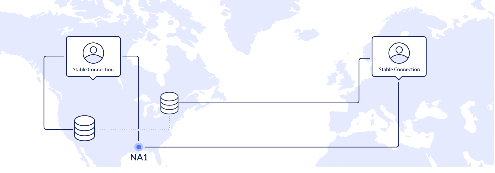

**Primary on-prem DNS failed**
------------------------------
As you can see, the on-prem DNS infrastructure experiences a sudden failure and users are redirected to a secondary on-prem DNS to get access to our site or app. Sometimes secondary premises or CPE based DNS infrastructure fails. Maybe the increased traffic causes degraded performance or other issues, maybe it is hit with an attack - either of these scenarios could knock both the on-prem DNS servers offline, leaving your site or app unreachable.

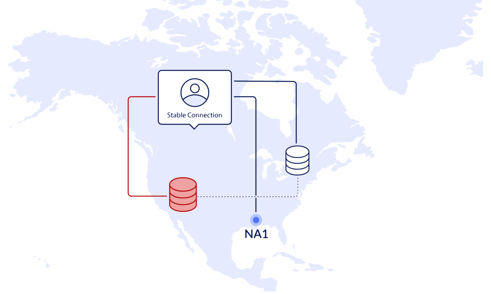

**Complete DNS Failure**
------------------------
DNS failure is not uncommon. Whether you have a single on-prem, CPE based DNS solution with backup or a single cloud DNS solution you are likely to be struggling with increasing traffic demands and experiencing degraded performance or vulnerable to an outage due to a growing threat of attacks. As in this scenario even with redundant premises based DNS infrastructure our site/app was knocked offline with users unable to access the resource.

This outcome is not acceptable for most organizations today, so let's see how quick and easy it is to set up F5 Distributed Cloud DNS as a global, SaaS-based, secondary authoritative DNS solution - delivering scalable, global access points to backup and redirect users’ requests to our site/app.

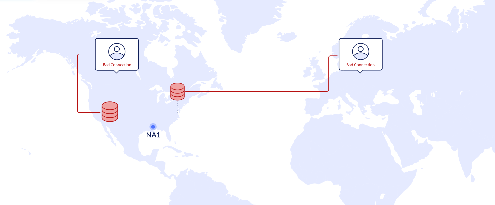

2. Secondary DNS Service
========================

**Creating Secondary Zone**
---------------------------
Just follow the hints to create a secure, secondary DNS zone for our sample site/app. With just a few clicks and inputs you will have a secondary DNS service up and running.

All you will need to do is...

1) Add a DNS Zone and give it a name, based on the site or apps domain
2) Set up the zone type as a 'Secondary DNS Configuration'
3) Enter the DNS primary server IP address
4) Set up authentication (e.g. TSIG) if configured on the primary DNS service

**Step by Step Process**:  

Log in the F5 Distributed Cloud Console and navigate to the ``DNS Management``.

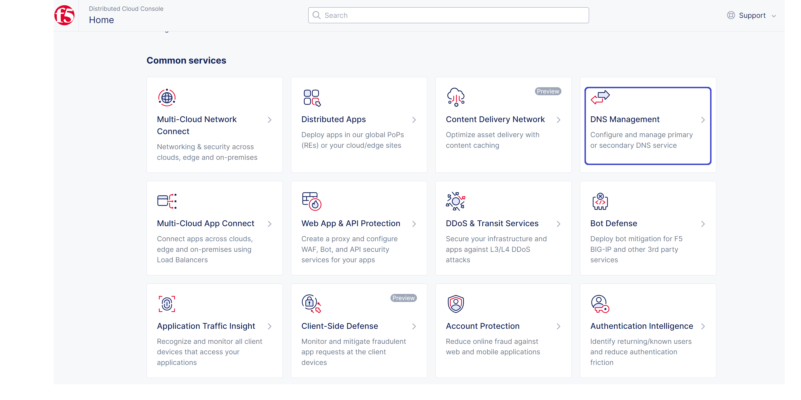

Click on ``Add DNS Zone``.

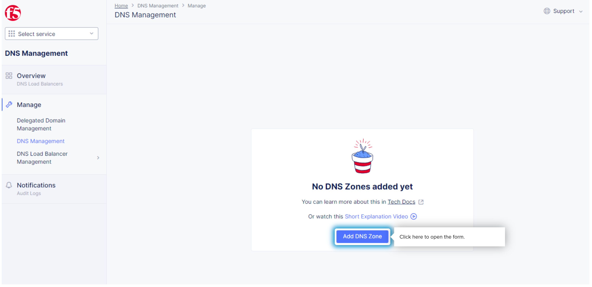

Enter **upmix-research.online** as domain name for this demo. Open the Zone Type menu, select ``Secondary DNS Configuration`` and then click on ``Configure`` button.

.. figure:: Assets/image6.png

Type in **203.0.113.1** as the first DNS primary server IP and then **203.0.113.2** as the second DNS primary server IP. ``Apply`` the Zone configuration.

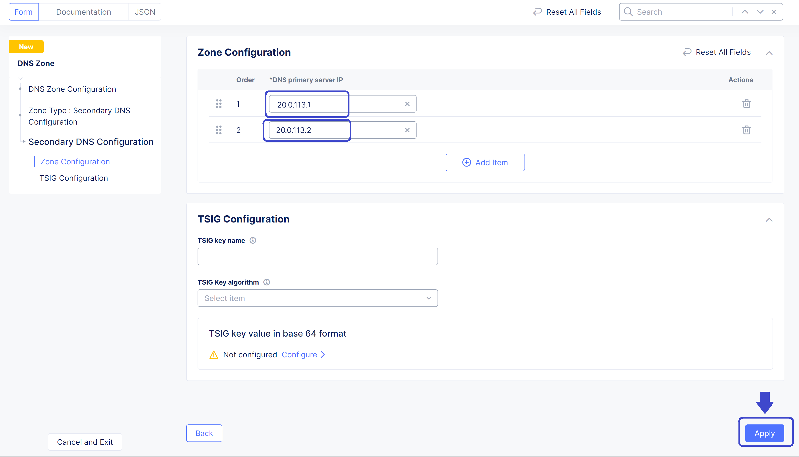

Take a look at the created DNS zone and click to ``save`` it.

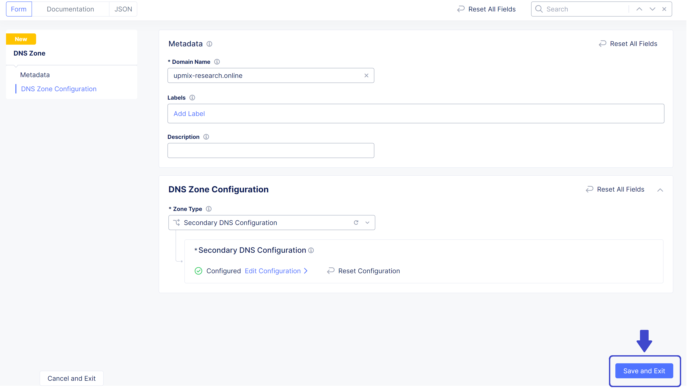

Verify that Zone is created sucessfully.

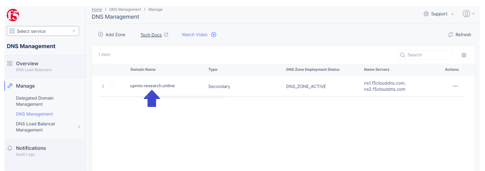

That's it! Let's get started. Just click the DNS Management tile and you will be off and running, just follow the prompts throughout.

3. DNS Cloud Service
====================
Now all the users can access the site/app any time even if the on-premises DNS fails, because all traffic is routed to the F5 Distributed Cloud DNS automatically in the event of degraded performance or an outage to our primary infrastructure. Now that you've added a SaaS-based secondary DNS solution with an Anycast network and global access points, our site/app is always available and able to resolve queries for our distributed user base quickly in case of primary DNS degradation or failure.

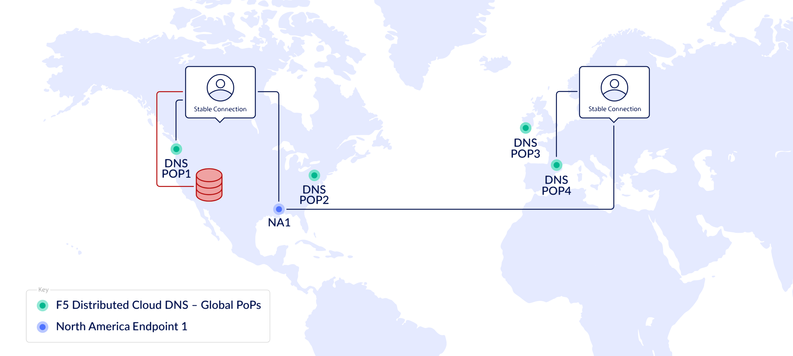

Conclusion
==========
As you can see it takes just a few steps and inputs to create a secondary DNS zone and activate the secondary DNS service, which in the end keeps all of your users and/or customers happy!

Module 2: Secure secondary DNS with F5 Distributed Cloud DNS
************************************************************

1. On-Prem DNS without DDoS Protection
======================================

**On-prem DNS Infrastructure Failure**
--------------------------------------
In this scenario let's assume we have existing on-premises DNS infrastructure supporting our site or application. What happens if this infrastructure experiences degraded performance due to a DDoS attack or increasing traffic demands and is completely knocked offline for a period of time.

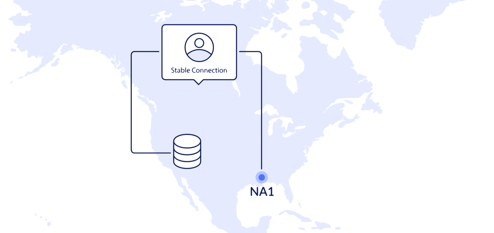

**On-prem DNS Attacked**
------------------------

As you can see, our on-prem DNS servers are vulnerable, unable to hold up to a DDoS attack, which caused our site/app resources to become inaccessible. At the same time, setting up protection and maintaining DDoS mitigation service and infrastructure against attacks can be costly and challenging, but not with F5 Distributed Cloud DNS!

F5 Distributed Cloud DNS can act as a primary or secondary authoritative DNS solution with global access points (POPs) via an Anycast network, helping organizations easily scale their DNS footprints. More efficiently keeping up with increasing traffic demands and resolving queries locally for distributed user/customer bases.

It also has built-in DDoS protection, while many on-prem DNS infrastructure doesn't or has capacity limitations to handle growing attack sizes.

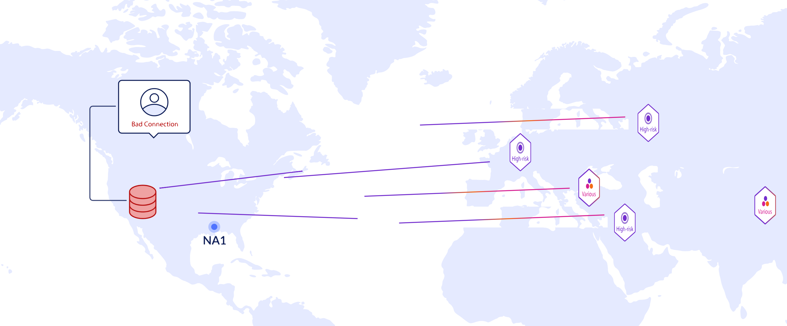

Now quickly set up a secondary DNS instance by performing a very easy zone transfer.

2. Secondary DNS Service
========================

**Create Secondary Zone**
-------------------------
Just follow the hints to create a secure, secondary DNS zone for our sample site/app. With just a few clicks and inputs you will have a secondary DNS service up and running.

All you will need to do is...

1) Add a DNS Zone and give it a name, based on the site or apps domain
2) Set up the zone type as a 'Secondary DNS Configuration'
3) Enter the DNS primary server IP address
4) Set up authentication (e.g. TSIG) if configured on the primary DNS service

**Step by Step Process**:  

Log in the F5 Distributed Cloud Console and navigate to the ``DNS Management``.

Click on ``Add DNS Zone``.

Enter **upmix-research.online** as domain name for this demo. Open the Zone Type menu, select ``Secondary DNS Configuration`` and then click on ``Configure`` button.

.. figure:: Assets/image6.png

Type in **203.0.113.1** as the first DNS primary server IP and then **203.0.113.2** as the second DNS primary server IP. ``Apply`` the Zone configuration.

Take a look at the created DNS zone and click to ``save`` it.

Verify that Zone is created sucessfully.

Our secondary DNS Zone is now created so all we need to do is enter the IP address(es) for the list of the primary zone servers. Then simply click Apply and then Save and Exit to view our newly created secondary DNS zone.
We just created a new secondary DNS zone for our site/app. It will take some time for the zone to change status from pending to active so we can validate our Secondary DNS Zone is up and running.

3. DNS Cloud Service with DDoS Protection
=========================================

**Cloud Secondary DNS with built-in protection**
------------------------------------------------

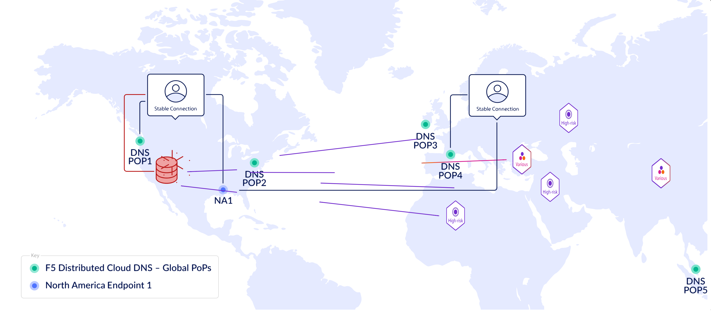

As you can see, our site/app now remains highly available despite a continuous barrage of DDoS attacks trying to take down our on-prem DNS infrastructure.

With F5 Distributed Cloud DNS serving as a secondary DNS solution, our global users are redirected to the nearest cloud-based Point of Presence (PoP) to resolve DNS queries, and in case of a complete failure of primary DNS - F5 has you covered!

Module 3: Primary DNS with F5 Distributed Cloud DNS
***************************************************

1. Inroduction
==============
Extending traditional DNS to an organizations web site and apps across different environments, especially those running in the cloud, can be cumbersome to manage. Most on-premises DNS solutions don’t scale efficiently to support today’s ever expanding app footprints. It can be time consuming and costly to establish a DNS service for modern apps that easily integrates into CI/CD pipelines and critical development workflows. That increases the challenge of providing the app services necessary to securely deliver applications while meeting the performance and uptime expectations of users in our hyper digital world.

It doesn’t have to be this difficult. Not anymore. F5 Distributed Cloud DNS simplifies DNS delivery globally, across multi-cloud environments, traditional and modern apps.

Let’s go ahead and show you how easy it is to set up a primary DNS service with F5 Distributed Cloud DNS.

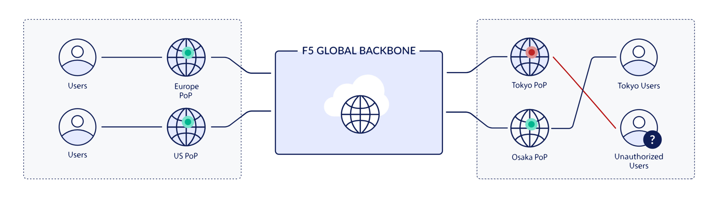

2. Primary DNS Service
======================
Just follow the hints to create a primary DNS zone for our sample app. With just a few clicks and inputs you will have a primary DNS service up and running.

All you will need to do is...

1) Add a DNS Zone and​ give it a name, based on the site or apps domain
2) Set up the zone type as a 'Primary DNS Configuration'
3) Create the appropriate resource records, for example, A, AAAA, CNAME, ALIAS etc.

**Step by Step Process**:  

Log in the F5 Distributed Cloud Console and navigate to the ``DNS Management``.

Click on ``Add DNS Zone``.

.. figure:: Assets/prdns1.png

Enter **test3.gago.net** as domain name for this demo. Open the Zone Type menu, select ``Primary DNS Configuration`` and then click on ``View Configuration`` button.

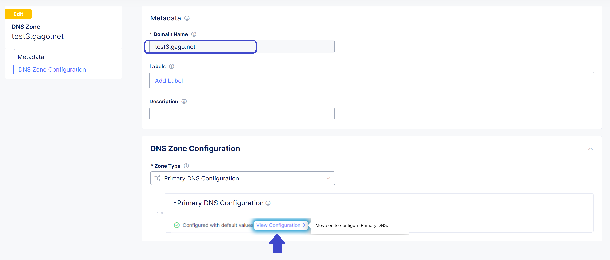

Click to ``Add Item`` under Resource Record Set with SOA record param as ``Default parameters``.

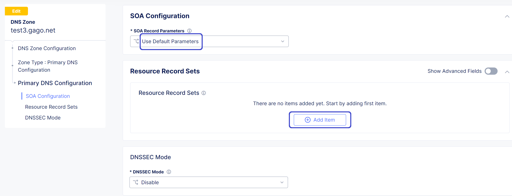

Type the TLL value, record set type and IPv4 address and ``Apply`` the record set configuration.

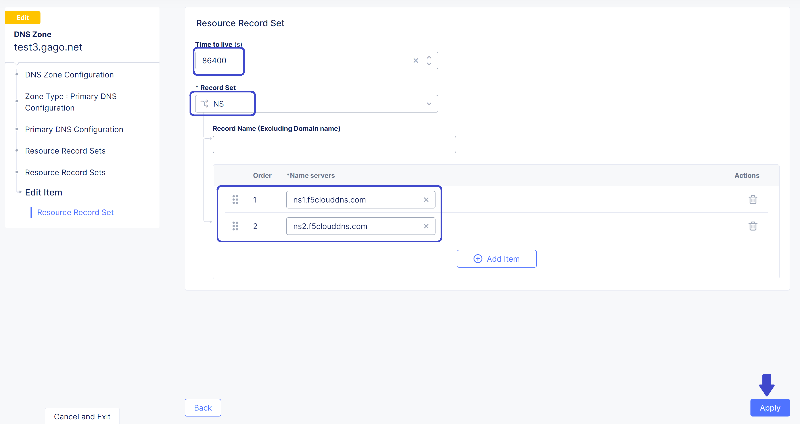

``Apply`` the SOA configuration.

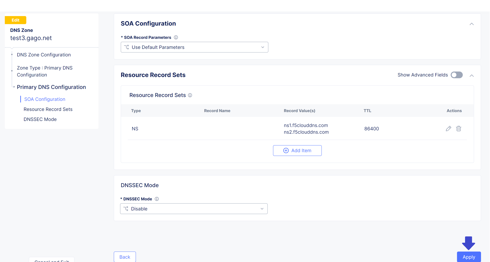

Take a look at the DNS Zone configuration and click on ``Save and Exit``.

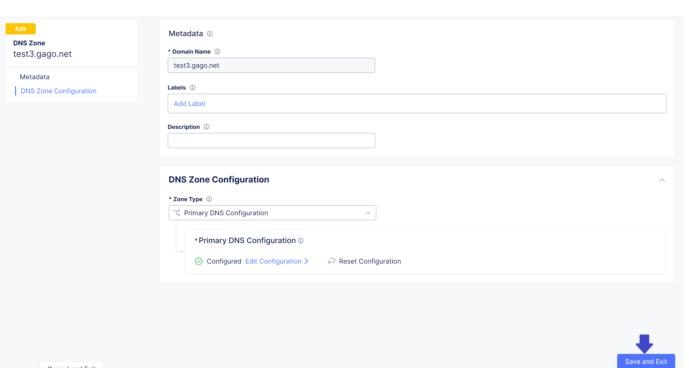

Verify that DNS Zone is added successfully and proceed to rest the created DNS Service.

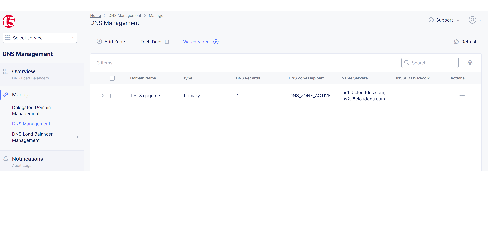

3. Testing
==========

Now that the primary zone is added with the list of its name servers, we can test it by running a command in any terminal.

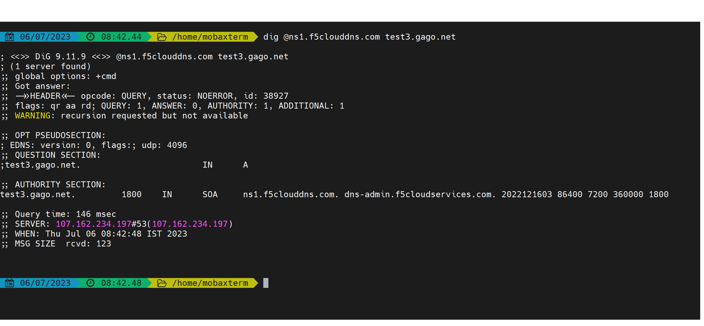

As you can see from the output, the created record is there. You just need to update the DNS domain settings with your registrar to point to the F5 Distributed Cloud Platform to start sending queries. It's really that quick and easy. Now primary DNS is set up and clients can access your site or app globally via our distributed PoPs providing maximum uptime and performance.

Module 4: Powerful DNS Load Balancing and Disastor recovery
***************************************************

1. Introduction
==============
At first, login to F5 Distributed Cloud Console and navigate to ``DNS Management``.

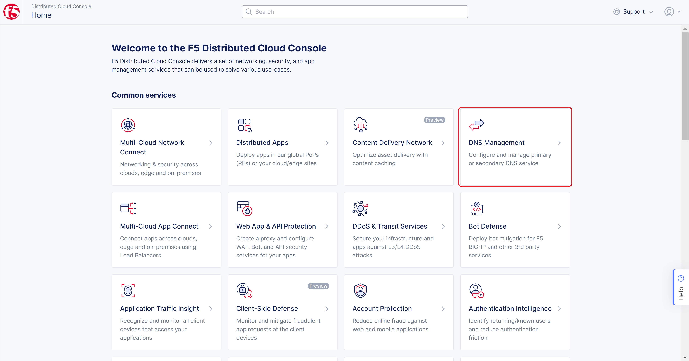

In the left-side navigation panel proceed to the Manage section, click on DNS Management. When the page opens, click the Add zone button.

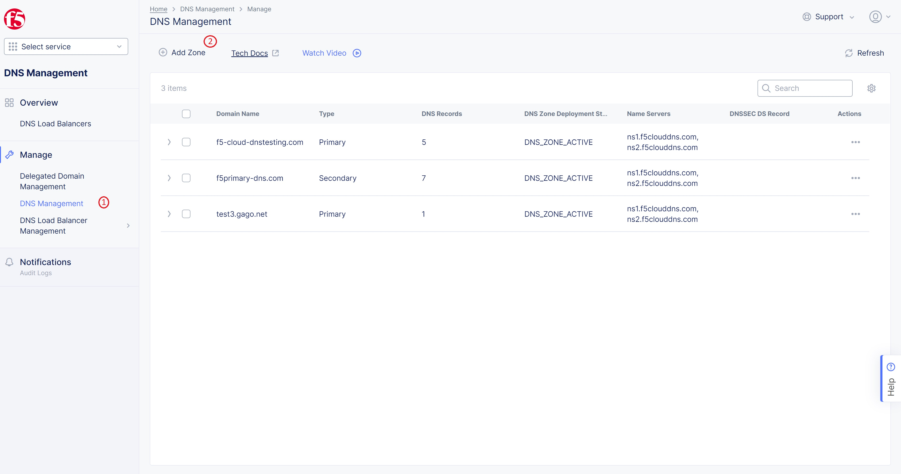
In the Metadata section, give the Domain Name as ``f5-cloud-dnstesting.com``. Under DNS Zone Configuration section, setup Zone Type as ``Primary DNS Configuration`` and click on Edit Configuration.

.. figure:: Assets/config-page.jpg
adfasdfasdf

1. Step by Step config process
==============

3. Testing
==============
